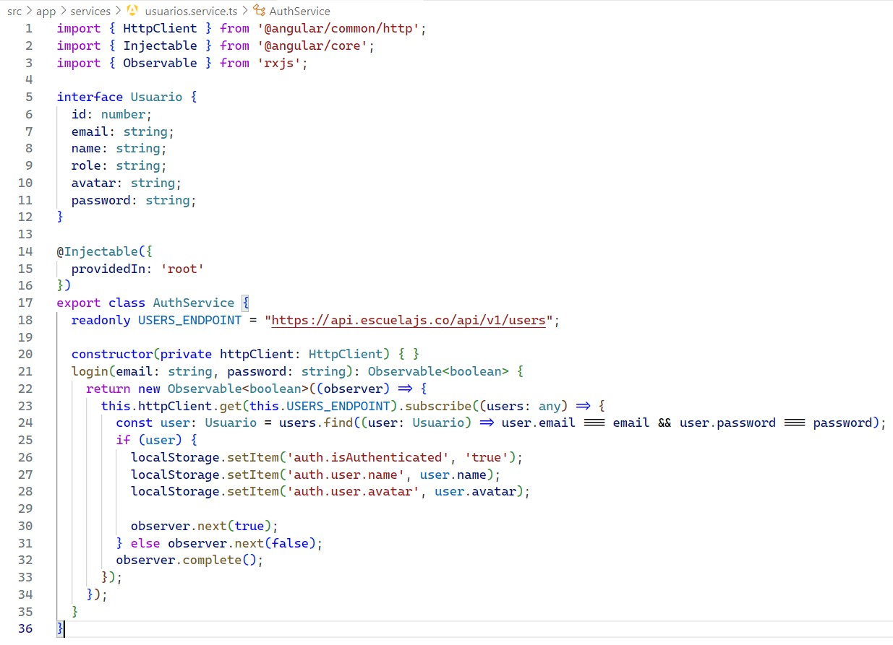
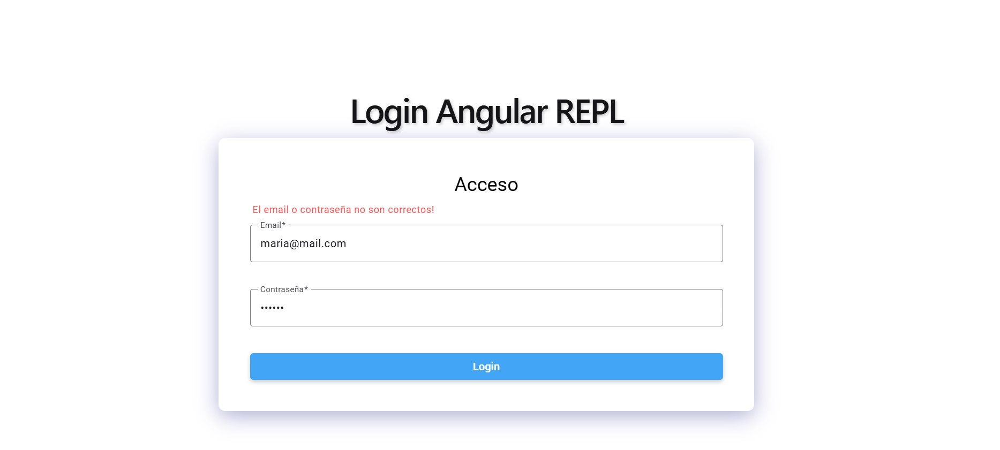
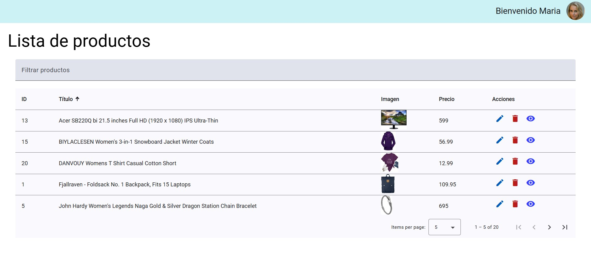

# Consumo de API de terceros - Ejercicio Login

## Raúl Emiliano Pérez López

## Consumo de API de Terceros y Login

En este proyecto, vamos a crear una aplicación simple de login en Angular. El objetivo es verificar si las credenciales de usuario (email y password) proporcionadas por el usuario existen en un array de usuarios que obtendremos desde una API externa. Usaremos la API de **EscuelaJS** para obtener los datos de los usuarios.

#### Características principales:
- **Consumo de API REST:** Se realiza una solicitud HTTP GET al endpoint de usuarios para obtener los datos.
- **Angular Material:** Se utiliza Angular Material para la construcción de una tabla estilizada y funcional.
- **Modularidad:** Código estructurado siguiendo las mejores prácticas de Angular, con componentes reutilizables y servicios centralizados para el consumo de la API.

#### Tecnologías Utilizadas:
- **Angular**: Framework para el desarrollo de aplicaciones web SPA.
- **Angular Material**: Biblioteca de componentes UI basados en Material Design.
- **HttpClientModule**: Módulo de Angular para manejar solicitudes HTTP.
- **TypeScript**: Lenguaje principal para el desarrollo en Angular.
- **CSS**: Para estilos de los elementos HTML

### Paso 1: Creación del Proyecto

Para iniciar el proyecto, se utiliza Angular CLI, una herramienta que facilita la creación y configuración inicial de aplicaciones Angular. Sigue los pasos a continuación para crear el proyecto:

#### Comando para crear el proyecto
Se ejecuta el siguiente comando en tu terminal para generar una nueva aplicación Angular

#### Detalles del Comando:
- `ng new`: Comando de Angular CLI para crear un nuevo proyecto.
- `consumo-api-REPL`: Nombre del proyecto. Este será el directorio que contendrá todos los archivos y configuraciones del proyecto.

#### Proceso involucrado durante la ejecución:
1. **Seleccionar configuraciones:**
   - **¿Quieres agregar Angular Routing?**  
     Se eelecciona `Yes` para incluir el módulo de routing si se requiere en el futuro para navegación entre vistas.
   - **Seleccionar el estilo predeterminado:**  
     Se elige `CSS` para manejar los estilos de los elementos.

2. **Generación del proyecto:**
   Angular CLI creará automáticamente la estructura de carpetas, configuraciones iniciales y descargará las dependencias necesarias.

#### Resultado:
Después de completar el proceso, se obtiene una nueva carpeta llamada `consumo-api-REPL`, que contiene la estructura básica del proyecto Angular.

### Paso 2: Instalación de Angular Material

Angular Material es una biblioteca de componentes de UI que sigue las directrices de Material Design. Proporciona componentes como tablas, botones, formularios, y más, que pueden ser utilizados para crear interfaces modernas y atractivas. En este paso, se va a instalar Angular Material en el proyecto.

#### Procesos involucrados durante la instalación:
1. **Selección de un tema:**
   El comando te pedirá que elijas un tema prediseñado de Angular Material. Yo escogí el siguiente
   - **Azure/Blue** (tema por defecto)

2. **Configuración de animaciones:**
   Angular Material requiere que el módulo `BrowserAnimationsModule` esté habilitado para poder usar animaciones. El comando agregará automáticamente este módulo al archivo `app.module.ts`.

3. **Instalación de dependencias:**
   Angular CLI descargará e instalará todas las dependencias necesarias de Angular Material y las agregará a tu archivo `package.json`.

#### Resultado:
Al finalizar, el proyecto estará listo para usar los componentes de Angular Material. El archivo `angular.json` se actualizará con las configuraciones del tema seleccionado, y el archivo `app.module.ts` tendrá las importaciones necesarias para empezar a utilizar los componentes de Material.

### Paso 3: Generar componente de Dashboard

Este será el componente al que el usuario accederá si el login fue existoso

### Paso 4: Generar el servicio de usuarios

### Paso 5: Proporcionar el el cliente HTTP a la aplicación

### Paso 6: Definir la ruta del dashboard

Este será el componente al que el usuario accederá si el login fue existoso

### Paso 7: Configurar el servicio de usuarios

Para ello se define la lógica de login accediendo a la API de terceros de la escuela y verificando si el email y el password se encuentran en el array devuelto.

### Paso 8: Crear NTML para el formulario de login

### Paso 9: Dar estilos CSS al formulario de login

### Paso 10: Crear el HTML del dashboard

Este será el componente que verá después de un login exitoso, solo contiene un título de bienvenida

### Pruebas

Ejecutamos el proyecto con el comando `ng serve` y lo abrimos en el navegador

### Login incorrecto

Se muestra mensaje de error

### Login correcto

Se redirecciona a /dashboard

